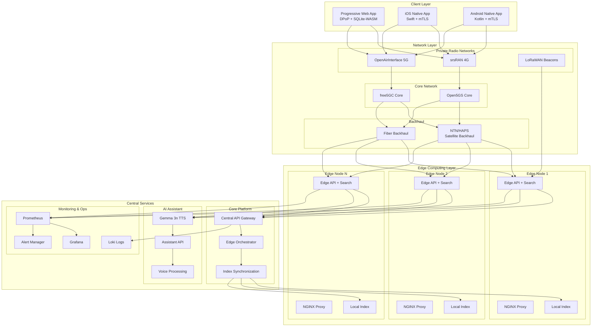
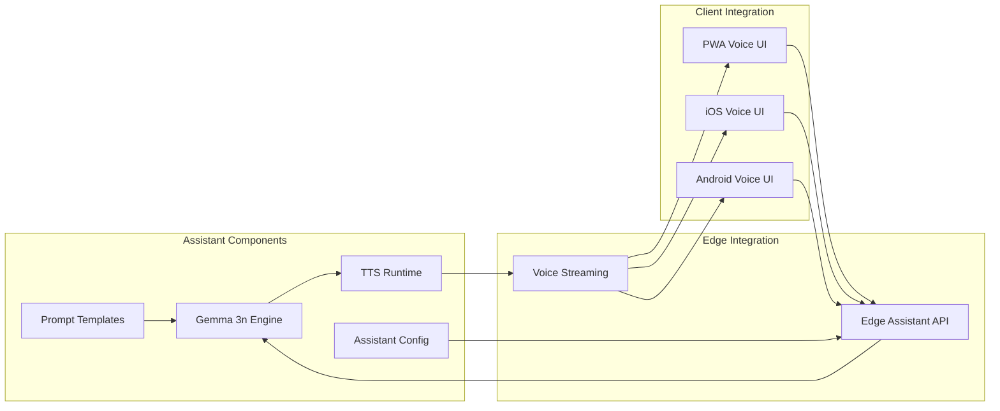
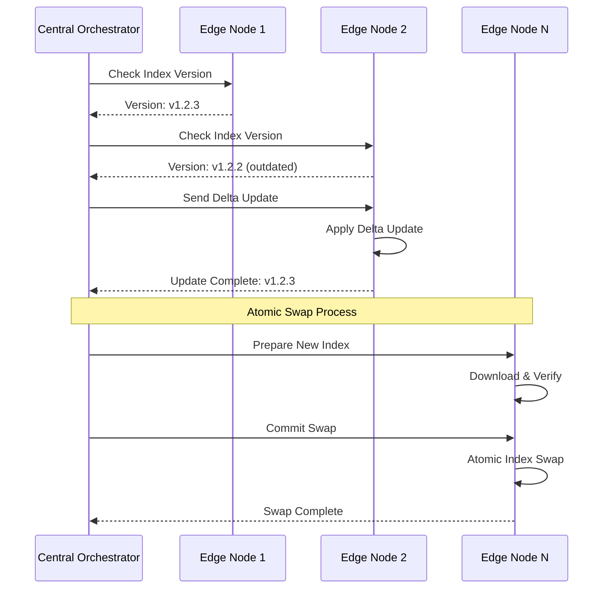
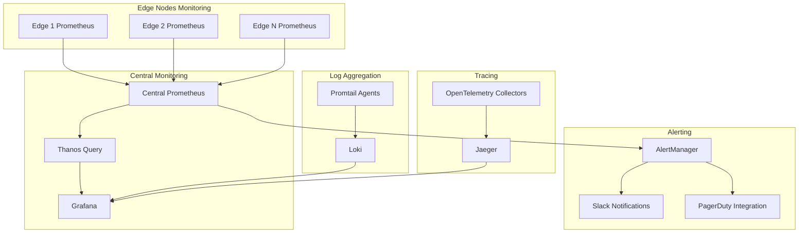
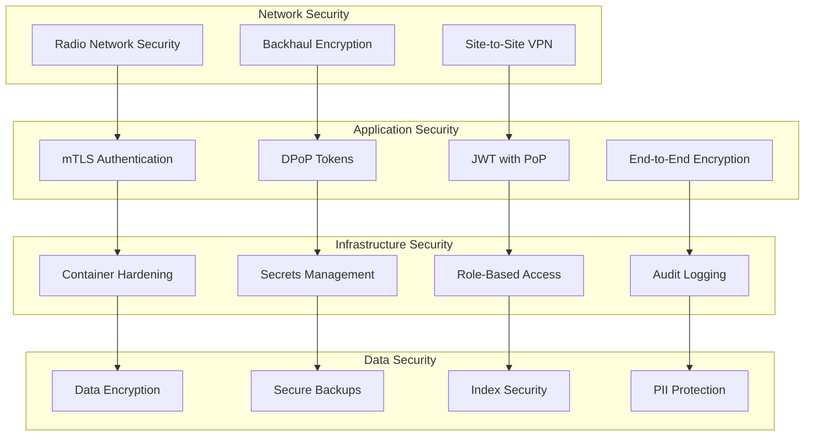

# Enhanced Architecture - Grahmos V1+V2 with NTN/RAN + Edge

## 🌐 Architecture Evolution: Current vs Enhanced

### Current Architecture (V1+V2 Unified)
- Local-only offline search
- Single deployment target
- Basic container orchestration

### Enhanced Architecture (NTN/RAN + Edge)
- **Private 4G/5G Networks**: srsRAN/OAI integration
- **Core Network**: Open5GS/free5GC implementation  
- **Edge Search/API Nodes**: Distributed edge computing
- **LoRaWAN Beacons**: Optional IoT connectivity
- **NTN/HAPS Backhaul**: Non-terrestrial network connectivity
- **Multi-client Support**: PWA, iOS, Android with native networking

## 🏗️ Enhanced System Architecture



## 📱 Multi-Client Architecture

### Progressive Web App (PWA)
```typescript
// DPoP Authentication + SQLite-WASM Mini-Index
interface PWAArchitecture {
  authentication: {
    method: "DPoP";
    tokenStorage: "secure-storage";
    proofOfPossession: "required";
  };
  
  offlineCapability: {
    engine: "SQLite-WASM";
    indexType: "mini-index";
    syncStrategy: "differential";
    storageLimit: "50MB";
  };
  
  networking: {
    protocol: "HTTPS";
    fallback: "offline-first";
    edgeDiscovery: "automatic";
  };
}
```

### Native Mobile Apps
```swift
// iOS - Swift with mTLS
class EdgeClient {
    private let mtlsConfig: MTLSConfiguration
    private let certificateStore: SecureKeychain
    
    func authenticateWithEdge() -> AuthResult {
        // mTLS handshake with edge node
        // Certificate-based authentication
        // Secure token exchange
    }
    
    func searchOffline(query: String) -> SearchResults {
        // Local SQLite index query
        // Fallback to cached results
    }
}
```

```kotlin
// Android - Kotlin with mTLS
class EdgeClient {
    private val mtlsConfig: MTLSConfig
    private val keyStore: AndroidKeyStore
    
    fun authenticateWithEdge(): AuthResult {
        // mTLS handshake implementation
        // Certificate validation
        // Secure token management
    }
    
    fun searchOffline(query: String): SearchResults {
        // SQLite local search
        // Cache management
    }
}
```

## 🎙️ AI Assistant Integration (Gemma 3n)

### Assistant Architecture


### Assistant Configuration
```json
{
  "assistant": {
    "engine": "gemma-3n",
    "tts": {
      "runtime": "gpt-oss-tts",
      "voiceModel": "natural-voice-v2",
      "streaming": true,
      "latency": "< 200ms"
    },
    "prompts": {
      "onboarding": "templates/onboarding.prompt",
      "search": "templates/search.prompt",
      "walkthrough": "templates/walkthrough.prompt"
    },
    "endpoints": {
      "voice": "/assistant/voice",
      "chat": "/assistant/chat",
      "tts": "/assistant/tts"
    }
  }
}
```

## 🌍 Edge Computing Distribution

### Edge Node Architecture
```yaml
# Edge Node Configuration
edge_node:
  location: "edge-site-001"
  coordinates: [lat, lon]
  
  services:
    - edge-api:
        replicas: 2
        resources:
          cpu: "2 cores"
          memory: "4GB"
          storage: "100GB NVMe"
    
    - search-index:
        engine: "meilisearch"
        index_size: "10GB"
        sync_interval: "5min"
    
    - nginx-proxy:
        ssl_termination: true
        rate_limiting: "1000 req/min"
        caching: "enabled"
    
    - assistant:
        model: "gemma-3n"
        tts_enabled: true
        voice_streaming: true

  connectivity:
    primary: "fiber-backhaul"
    backup: "ntn-satellite"
    local_radio: ["4G-srsRAN", "5G-OAI", "LoRaWAN"]
  
  monitoring:
    prometheus_endpoint: ":9090"
    health_check: "/health"
    metrics_retention: "7d"
```

### Index Synchronization Strategy


## 📡 Network Layer Details

### Private Radio Networks

#### srsRAN 4G Configuration
```yaml
# srsRAN 4G Base Station
srsran_4g:
  enb:
    enb_id: 0x19B
    cell_id: 0x01
    tac: 0x0007
    pci: 1
    dl_earfcn: 3350
    n_prb: 50
    
  network:
    mcc: 001
    mnc: 01
    
  core_network:
    mme_addr: "192.168.1.10"
    gtp_bind_addr: "192.168.1.11"
```

#### OpenAirInterface 5G Configuration
```yaml
# OAI 5G New Radio
oai_5g:
  gnb:
    gnb_id: 0xe00
    gnb_name: "gNB-OAI"
    tracking_area_code: 1
    plmn:
      mcc: 001
      mnc: 01
    
  radio:
    dl_frequency: 3500000000  # 3.5 GHz
    ul_frequency: 3500000000
    bandwidth: 20  # MHz
    
  core_network:
    amf_ip: "192.168.1.20"
    n2_interface: "192.168.1.21"
    n3_interface: "192.168.1.22"
```

### Core Network Integration

#### Open5GS Configuration
```yaml
# Open5GS 5G Core Network
open5gs:
  amf:
    sbi:
      - addr: 127.0.0.5
        port: 7777
    ngap:
      - addr: 127.0.0.5
    
  smf:
    sbi:
      - addr: 127.0.0.4
        port: 7777
    pfcp:
      - addr: 127.0.0.4
    
  upf:
    pfcp:
      - addr: 127.0.0.7
    gtpu:
      - addr: 127.0.0.7

  nrf:
    sbi:
      - addr: 127.0.0.10
        port: 7777
```

### LoRaWAN Integration
```yaml
# LoRaWAN Network Configuration
lorawan:
  network_server:
    gateway_backend:
      mqtt:
        server: "tcp://localhost:1883"
        username: "grahmos"
        password: "secure_password"
    
  device_profiles:
    - name: "grahmos-beacon"
      mac_version: "1.0.3"
      reg_params_revision: "B"
      max_eirp: 14
      
  applications:
    - name: "grahmos-search"
      description: "Search query beacons"
      service_profile_id: "service-profile-1"
```

## 🔄 CI/CD Pipeline Enhancement

### Enhanced Pipeline Architecture

```mermaid
graph LR
    subgraph "Source Control"
        GIT[Git Repository]
        BRANCH[Feature Branch]
    end
    
    subgraph "Build Stage"
        BUILD[Multi-target Build]
        EDGE_BUILD[Edge API Build]
        PWA_BUILD[PWA Build]
        MOBILE_BUILD[Mobile Apps Build]
        ASSISTANT_BUILD[Assistant Build]
    end
    
    subgraph "Testing Stage"
        UNIT[Unit Tests]
        INTEGRATION[Integration Tests]
        SECURITY[Security Scans]
        PERFORMANCE[Performance Tests]
    end
    
    subgraph "Packaging Stage"
        DOCKER[Docker Images]
        MOBILE_APPS[Mobile Apps]
        PWA_DIST[PWA Distribution]
        SIGNING[Code Signing]
    end
    
    subgraph "Deployment Stage"
        STAGING[Staging Deploy]
        EDGE_DEPLOY[Edge Node Deploy]
        CENTRAL_DEPLOY[Central Deploy]
        MOBILE_DEPLOY[App Store Deploy]
    end
    
    GIT --> BUILD
    BRANCH --> BUILD
    
    BUILD --> EDGE_BUILD
    BUILD --> PWA_BUILD
    BUILD --> MOBILE_BUILD
    BUILD --> ASSISTANT_BUILD
    
    EDGE_BUILD --> UNIT
    PWA_BUILD --> UNIT
    MOBILE_BUILD --> UNIT
    ASSISTANT_BUILD --> UNIT
    
    UNIT --> INTEGRATION
    INTEGRATION --> SECURITY
    SECURITY --> PERFORMANCE
    
    PERFORMANCE --> DOCKER
    DOCKER --> MOBILE_APPS
    MOBILE_APPS --> PWA_DIST
    PWA_DIST --> SIGNING
    
    SIGNING --> STAGING
    STAGING --> EDGE_DEPLOY
    STAGING --> CENTRAL_DEPLOY
    STAGING --> MOBILE_DEPLOY
```


### GitHub Actions Workflow
```yaml
name: Enhanced CI/CD Pipeline

on:
  push:
    branches: [main, develop]
  pull_request:
    branches: [main]

jobs:
  build-matrix:
    strategy:
      matrix:
        component: [edge, pwa, ios, android, assistant]
    runs-on: ubuntu-latest
    
    steps:
    - uses: actions/checkout@v4
    
    - name: Build ${{ matrix.component }}
      run: make ${{ matrix.component }}
    
    - name: Test ${{ matrix.component }}
      run: make test-${{ matrix.component }}
    
    - name: Security Scan ${{ matrix.component }}
      run: make security-scan-${{ matrix.component }}

  deploy-edge-nodes:
    needs: build-matrix
    runs-on: ubuntu-latest
    if: github.ref == 'refs/heads/main'
    
    steps:
    - name: Deploy to Edge Nodes
      run: make deploy-edge-nodes
    
    - name: Verify Edge Deployment
      run: make verify-edge-deployment
    
    - name: Update Index Sync
      run: make sync-edge-indexes
```

## 📊 Enhanced Monitoring & Observability

### Distributed Monitoring Architecture


### Performance Targets

| Component | Latency Target | Throughput | Availability |
|-----------|---------------|------------|--------------|
| Edge API | < 50ms | 2k req/sec | 99.9% |
| PWA Search | < 150ms online | - | 99.5% |
| PWA Offline | < 200ms | - | 100% |
| Native Apps | < 100ms | - | 99.9% |
| Assistant TTS | < 200ms | 100 concurrent | 99.5% |
| Index Sync | < 5min | - | 99.9% |

## 🛡️ Enhanced Security Model

### Multi-Layer Security


## 📈 Scaling Strategy

### Horizontal Scaling
- **Edge Nodes**: Deploy additional edge nodes based on geographic coverage
- **Load Distribution**: Intelligent routing based on location and load
- **Index Partitioning**: Distribute search indexes across nodes
- **Caching Strategy**: Multi-tier caching (edge, regional, central)

### Vertical Scaling
- **Resource Optimization**: Dynamic resource allocation per edge node
- **Performance Tuning**: Optimize search algorithms and caching
- **Capacity Planning**: Predictive scaling based on usage patterns

## 🔧 Implementation Roadmap

### Phase 1: Foundation (Weeks 1-4)
1. Set up monorepo structure
2. Implement enhanced CI/CD pipeline
3. Deploy central monitoring infrastructure
4. Create edge node base configuration

### Phase 2: Network Integration (Weeks 5-8)
1. Integrate srsRAN/OAI components
2. Set up Open5GS/free5GC core networks
3. Implement LoRaWAN beacon support
4. Configure NTN/HAPS backhaul

### Phase 3: Client Applications (Weeks 9-12)
1. Enhance PWA with DPoP and SQLite-WASM
2. Develop native iOS/Android apps with mTLS
3. Integrate Gemma 3n assistant across all clients
4. Implement offline-first capabilities

### Phase 4: Edge Deployment (Weeks 13-16)
1. Deploy first edge nodes
2. Implement index synchronization
3. Set up distributed monitoring
4. Perform end-to-end testing

---

**Version**: 2.0.0 - Enhanced Architecture  
**Last Updated**: $(date)  
**Maintainer**: Grahmos Enhanced Architecture Team
