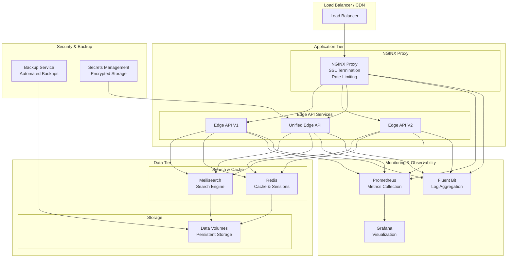
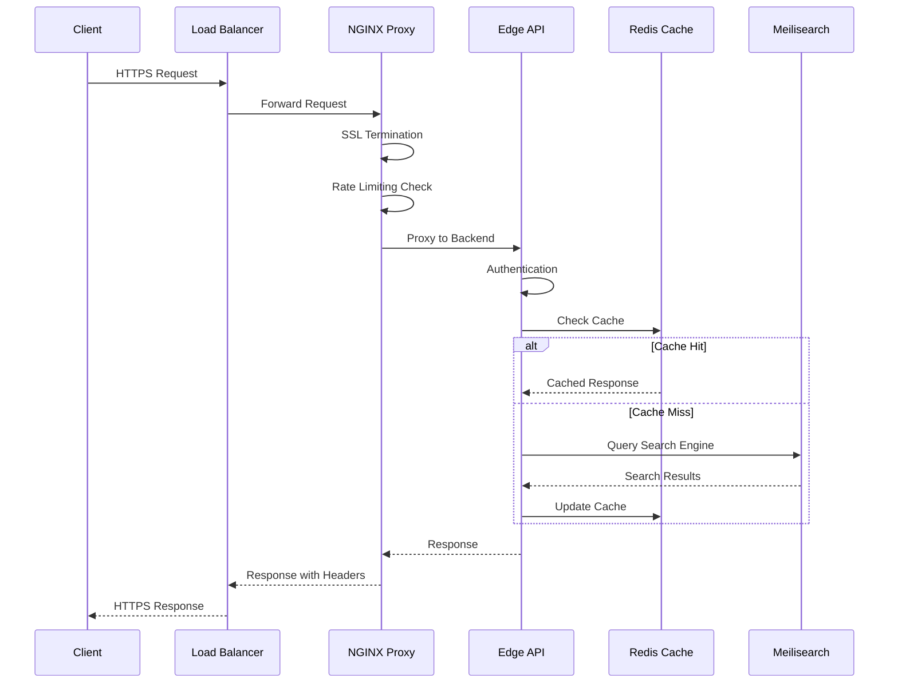
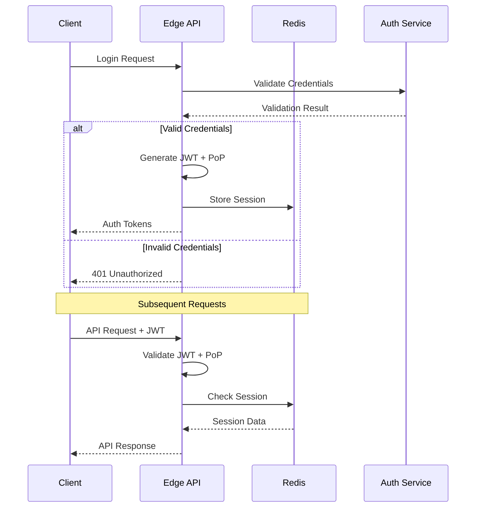
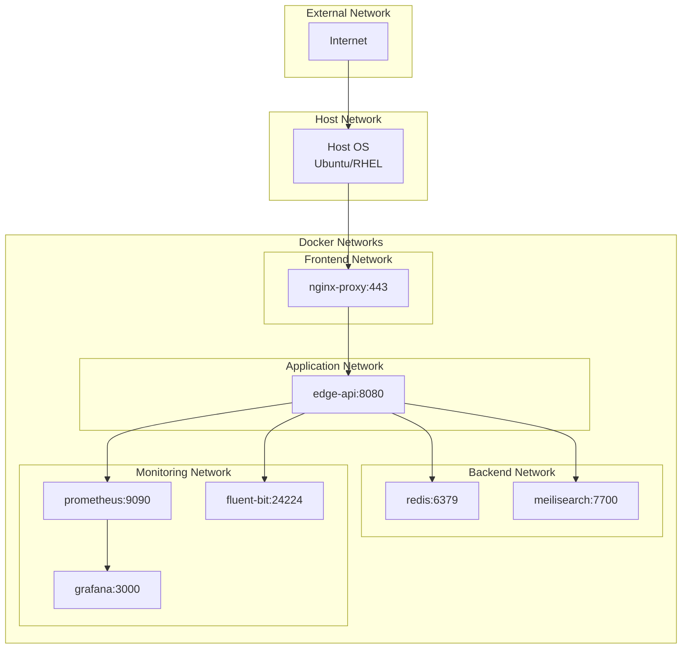
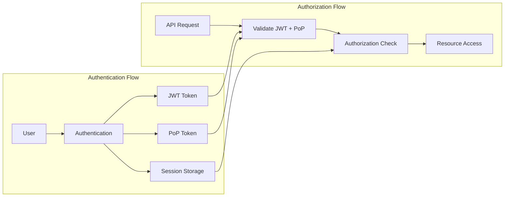
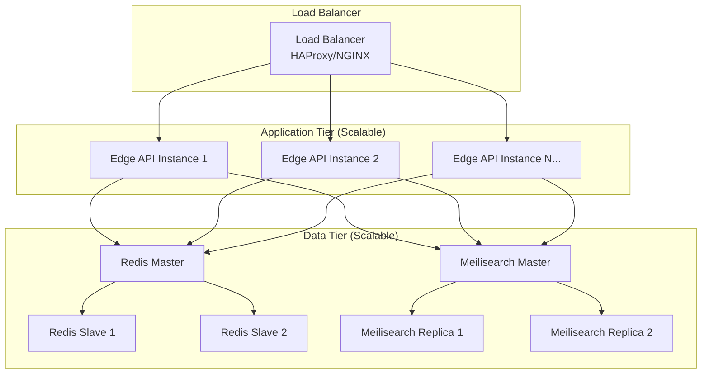
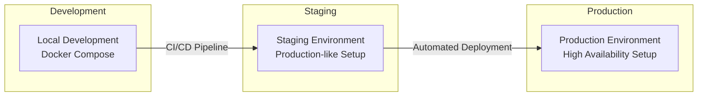
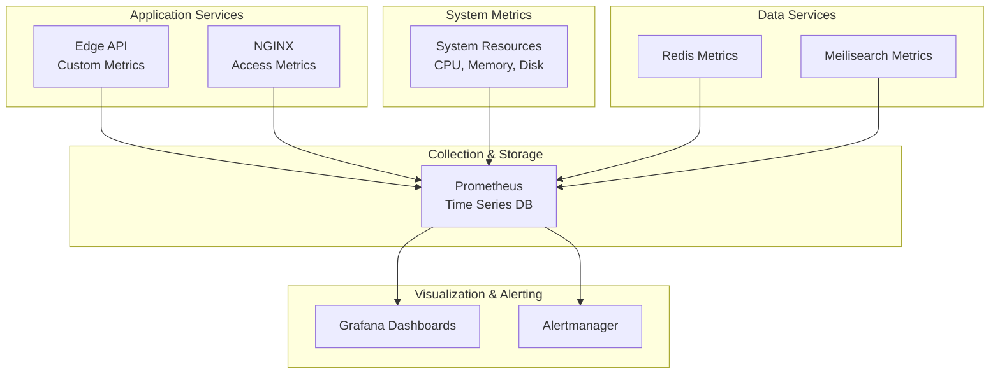
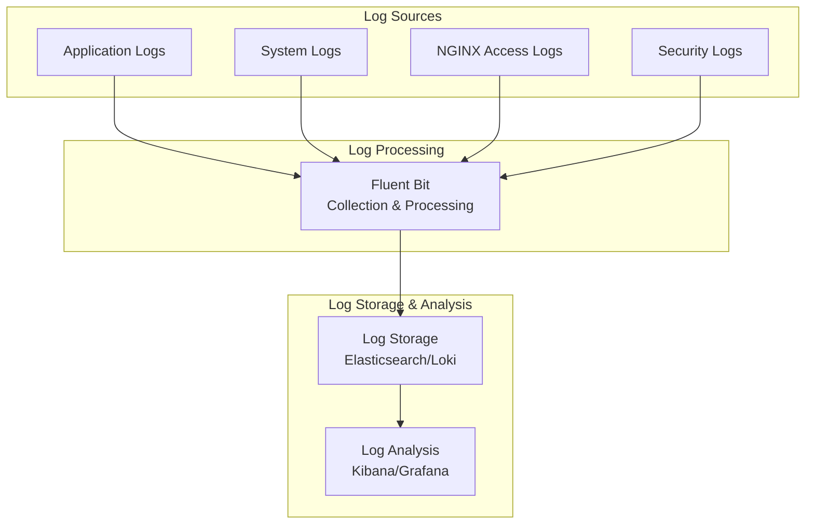
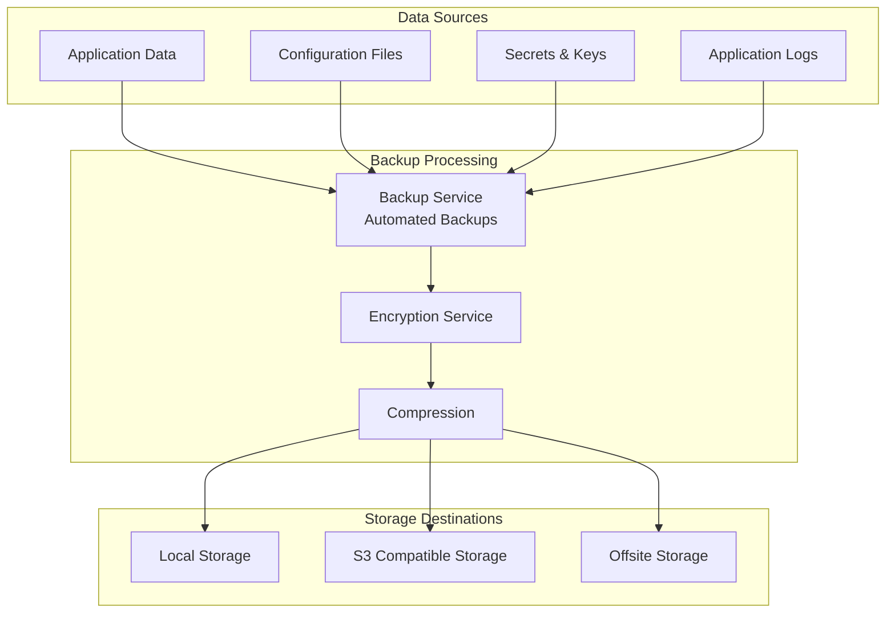

# System Architecture - Grahmos V1+V2 Unified

## 🏗️ Architecture Overview

The Grahmos V1+V2 Unified system is a production-ready, containerized application architecture designed for enterprise deployment with comprehensive security, monitoring, and operational capabilities.

> **📄 For Enhanced NTN/RAN + Edge Architecture**: See [Enhanced Architecture Document](./enhanced-architecture.md) for details on the evolved system supporting Non-Terrestrial Networks (NTN), Radio Access Networks (RAN), and distributed edge computing capabilities.

### Architecture Evolution

This document describes the current Grahmos V1+V2 unified system architecture. The system is designed to evolve towards:

- **NTN/RAN Integration**: Support for private 4G/5G networks and satellite backhaul
- **Edge Computing**: Distributed processing nodes for low-latency operations
- **Mobile-First Design**: PWA, iOS, and Android applications
- **Advanced Security**: DPoP tokens, TPM/HSM integration, document-level ACLs
- **Enhanced Monitoring**: Distributed observability with Thanos and OpenTelemetry

### Reference Architecture Documents

- **Current System**: This document (system-architecture.md)
- **Enhanced System**: [Enhanced Architecture](./enhanced-architecture.md)
- **Deployment Diagrams**: Referenced in [Enhanced Architecture Mermaid Diagrams](./enhanced-architecture.md#system-architecture-diagram)
- **Network Integration**: [Enhanced Architecture - Network Layer](./enhanced-architecture.md#network-layer-integration)
- **Mobile Architecture**: [Enhanced Architecture - Client Layer](./enhanced-architecture.md#client-layer-architecture)

## 📐 High-Level Architecture

## 🏛️ System Components

### Application Layer

#### NGINX Proxy
- **Purpose**: SSL termination, load balancing, reverse proxy
- **Key Features**:
  - TLS 1.2/1.3 support with strong cipher suites
  - Rate limiting and DDoS protection
  - Security headers injection
  - Request/response compression
  - Health check endpoints

#### Edge API Services
- **Edge API V1**: Legacy API compatibility layer
- **Edge API V2**: Enhanced API with new features
- **Unified Edge API**: Single endpoint supporting both V1 and V2 protocols
- **Key Features**:
  - RESTful API design
  - JWT authentication with PoP tokens
  - mTLS support for service-to-service communication
  - Comprehensive input validation
  - Rate limiting and throttling

### Data Layer

#### Meilisearch
- **Purpose**: High-performance search engine
- **Features**:
  - Full-text search capabilities
  - Real-time indexing
  - Typo tolerance and fuzzy matching
  - Faceted search and filtering
  - Multi-language support

#### Redis
- **Purpose**: Caching and session management
- **Features**:
  - In-memory data structure store
  - Session persistence
  - Cache with TTL support
  - Pub/Sub messaging
  - Data replication

### Monitoring Stack

#### Prometheus
- **Purpose**: Metrics collection and alerting
- **Metrics Collected**:
  - Application performance metrics
  - System resource utilization
  - Custom business metrics
  - Security event metrics
  - Service health indicators

#### Grafana
- **Purpose**: Visualization and dashboards
- **Dashboards**:
  - System overview dashboard
  - Application performance monitoring
  - Infrastructure monitoring
  - Security monitoring
  - Business metrics

#### Fluent Bit
- **Purpose**: Log collection and forwarding
- **Features**:
  - Lightweight log processor
  - Multiple input sources
  - Log parsing and enrichment
  - Multiple output destinations
  - Buffer management

### Security Layer

#### Secrets Management
- **Features**:
  - Encrypted secret storage
  - Automatic secret rotation
  - Access control and auditing
  - Integration with external vaults

#### Backup Service
- **Features**:
  - Automated backup scheduling
  - Incremental and full backups
  - Encryption at rest
  - Cloud storage integration
  - Backup verification

## 🔄 Data Flow

### Request Processing Flow

### Authentication Flow

## 🌐 Network Architecture

### Container Network Topology

### Port Mapping

| Service | Internal Port | External Port | Protocol |
|---------|---------------|---------------|----------|
| NGINX Proxy | 80, 443 | 80, 443 | HTTP/HTTPS |
| Edge API | 8080 | - | HTTP |
| Redis | 6379 | - | TCP |
| Meilisearch | 7700 | - | HTTP |
| Prometheus | 9090 | 9090* | HTTP |
| Grafana | 3000 | 3000* | HTTP |
| Fluent Bit | 24224 | - | TCP |

*Monitoring ports accessible only from localhost in production

## 🔒 Security Architecture

### Security Layers

1. **Network Security**
   - TLS encryption for all external communications
   - Network segmentation with Docker networks
   - Firewall rules limiting access
   - VPN access for administrative functions

2. **Application Security**
   - JWT authentication with Proof-of-Possession
   - mTLS for service-to-service communication
   - Input validation and sanitization
   - Rate limiting and throttling
   - Security headers (HSTS, CSP, etc.)

3. **Container Security**
   - Non-root user execution
   - Read-only file systems
   - Capability dropping
   - Resource limits and constraints
   - Security scanning and vulnerability management

4. **Data Security**
   - Encryption at rest for sensitive data
   - Encrypted backups
   - Secrets management with rotation
   - Data anonymization and pseudonymization

### Authentication & Authorization

## 📊 Scalability Design

### Horizontal Scaling

### Performance Characteristics

| Component | Target Latency | Throughput | Scalability |
|-----------|----------------|------------|-------------|
| NGINX Proxy | < 10ms | 10k+ req/sec | Horizontal |
| Edge API | < 100ms | 1k+ req/sec | Horizontal |
| Redis Cache | < 1ms | 100k+ ops/sec | Master-Slave |
| Meilisearch | < 50ms | 1k+ searches/sec | Master-Replica |

## 🔄 Deployment Architecture

### Environments

### Deployment Strategy

1. **Blue-Green Deployment**
   - Zero-downtime deployments
   - Instant rollback capability
   - Traffic switching at load balancer

2. **Rolling Updates**
   - Gradual service updates
   - Health check validation
   - Automatic rollback on failure

3. **Canary Releases**
   - Limited exposure testing
   - Gradual traffic shifting
   - Performance monitoring

## 📈 Monitoring Architecture

### Metrics Collection

### Log Architecture

## 🔄 Disaster Recovery

### Backup Strategy

### Recovery Objectives

| Component | RTO | RPO | Recovery Method |
|-----------|-----|-----|-----------------|
| Edge API | 15 minutes | 1 hour | Service restart |
| Redis Cache | 5 minutes | 15 minutes | Backup restore |
| Meilisearch | 30 minutes | 4 hours | Index rebuild |
| Configuration | 5 minutes | 24 hours | Config restore |

## 🔧 Operational Considerations

### Resource Requirements

| Environment | CPU | Memory | Storage | Network |
|-------------|-----|--------|---------|---------|
| Development | 4 cores | 8GB | 50GB | 1Gbps |
| Staging | 8 cores | 16GB | 200GB | 1Gbps |
| Production | 16+ cores | 32GB+ | 500GB+ | 10Gbps |

### Capacity Planning

1. **Application Tier**
   - Plan for 2x peak load capacity
   - Monitor response times and queue depths
   - Auto-scaling based on CPU and memory

2. **Data Tier**
   - Monitor cache hit ratios
   - Plan for 80% memory utilization
   - Monitor disk I/O and storage growth

3. **Network Tier**
   - Monitor bandwidth utilization
   - Plan for DDoS mitigation
   - CDN integration for static content

---

**Version**: 1.0.0  
**Last Updated**: $(date)  
**Maintainer**: Grahmos Architecture Team
